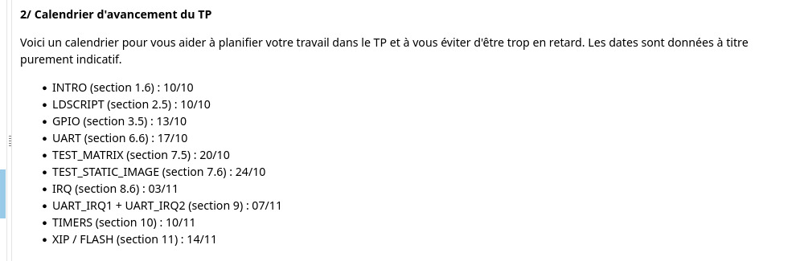

# stm32l475-baremetal
This is an assembly + C project in which a baremetal project without any SDK is implemented on the STM32L475 development board

# Implementation timeline


# How to build the project

## Prerequisites (Ubuntu)

```
GNU Make          >= 4.3
gcc-arm-none-eabi == 10.3-2021.10 package
JLinkGDBServer    == 8.70
```

# Why is this project useful
It illustrates the ways of implementing an embedded application on a development board without using it's SDK. This proves that there is no black magic going on in between the C programming and the flashing of the development board.

# License
Apache License v2.0